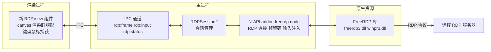
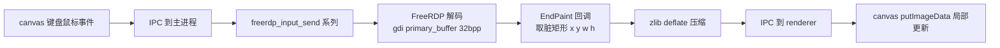

# FreeRDP 嵌入式 RDP 插件方案

> **实施进展（2026-08-25）**：Linux 侧已全部跑通并通过端到端验证：
> - `native/freerdp`：N-API addon（node-addon-api + FreeRDP 底层 API + 工作线程 +
>   ThreadSafeFunction）。连接（`connecting→connected`）、状态、错误处理正常；
>   帧链路用 **primary_buffer 整帧对比找脏区 bounding box + 30ms 节流**（因
>   `gdi->hdc->hwnd` 为 NULL，无法用 `hwnd->invalid`），8 秒数据量从整帧 2GB 降至
>   22MB；输入接口 `sendMouse/sendKey/sendUnicode` 就绪。
> - 真实服务器（10.10.186.32）验证：连接稳定、脏区增量帧输出。
> - Electron ABI 重编（node-gyp --target 43.4.1）后 addon 可在 Electron 主进程加载。
> - 主进程 `RDPSession2`（`src/main/connections/rdp2.ts`）替代 guacd，经 IPC
>   `rdp:frame`/`rdp:input`/`rdp:resize` 与渲染进程通信；preload 已加桥；
>   renderer 新增 `RDPView2`（canvas 脏区渲染 + 键盘/鼠标注入）。
> - **E2E 通过**（`scripts/test-rdp-e2e.cjs`）：双击 RDP → 真实 addon 连服务器 →
>   主进程广播帧 → renderer canvas 1280x720 渲染出画面（230258 非黑采样点）。
> - 打包：`rebuild-native.cjs` 扩展重建 freerdp addon；`extraResources` 分发
>   `resources/freerdp`（Windows dll）+ 编译的 freerdp.node；node-rdpjs 残留已清理。
> - **Windows 排障进展（2026-08-26）**：
>   - addon 隔离到 utility process（`src/main/rdp-worker.cjs` + `RDPSession2` fork）：
>     FreeRDP 崩溃只终止 worker，主程序/UI 稳定
>   - Windows 版 **freerdp 3.23.0 在 `freerdp_connect` 内崩溃**（0xc0000005，日志确认停在
>     connecting 后）→ **升级 workflow `FREERDP_VERSION` 到 3.30.0**（与 Linux 一致，已修崩溃）
>   - 强制 TLS（规避 3.23 崩溃的临时措施）会导致部分服务器 `transport layer failed`，
>     已**移除强制 TLS 恢复默认协商**
> - **ERRBASE_UNKNOWN 根因与解决（最终）**：FreeRDP WLog 定位到 **OpenSSL 3 LEGACY
>     provider 未加载**（`md4`/`rc4` 缺失）→ NTLM 认证不可用 + RDP licensing RC4 失败。
>     解决：`RDPSession2` fork worker 时通过 **env 传入 `OPENSSL_MODULES`（指向含
>     legacy.dll 的目录）+ `OPENSSL_CONF`（临时 openssl.cnf 启用 default+legacy）**，
>     worker 进程启动即生效 → **Windows 版 RDP 连接成功、画面正常显示**。
>   - **最终方案**：utility process 隔离 + FreeRDP 3.30.0 + 默认安全层协商 +
>     OpenSSL legacy provider（fork env 配置）。Windows/Linux 均验证通过。
> - **待办（Windows 侧）**：确认 ERRBASE_UNKNOWN 根因后修复；重跑 workflow 获得 3.30.0
>   开发包（include+lib）后配置 `native/freerdp/third_party`，Windows 编译 addon 并验证打包。

> 已确认信息（2026-08-25）：
> - **FreeRDP 3.23.0**（workflow `FREERDP_VERSION: "3.23.0"`，`WITH_CLIENT=ON`）
> - 产物位于 `resources/freerdp/`：`freerdp3.dll`、`freerdp-client3.dll`、`wfreerdp-client3.dll`、
>   `wfreerdp.exe`、`winpr3.dll`、`winpr-tools3.dll`、`legacy.dll` + OpenSSL/zlib/libusb dll
> - **符号验证（objdump 静态分析）**：
>   - `freerdp3.dll` 导出：`freerdp_connect` / `freerdp_context_new` / `freerdp_check_fds` /
>     `freerdp_input_send_*`（键盘/鼠标/unicode 全套）、`gdi_*` 解码函数
>   - `freerdp-client3.dll` 导出：`freerdp_client_context_new` / `freerdp_client_start` /
>     `freerdp_client_stop`（高级客户端 API）
>   - **`freerdp_get_gdi` / `freerdp_get_update_rect` 均未导出**（所有 dll 中均无）→
>     取帧需直接访问 `rdpContext` 内部结构（gdi 字段 + update 回调），**依赖与 3.23.0
>     完全匹配的头文件**；运行时也可尝试 GetProcAddress 兜底
> - 头文件：`resources/freerdp` 无 .h，且 FreeRDP 3 头文件含 **CMake 生成内容**
>   （`freerdp_settings_keys.h` 等），无法从源码直接复制 → 已修改
>   `build-windows-freerdp.yml` 额外打包 `freerdp-src/include` + `build/include`（生成头）
>   与 `*.lib`（import lib）到 `package/freerdp/{include,lib}`，重跑 workflow 即可获得
>   与 3.23.0 匹配的完整开发包
> - Linux 开发：Ubuntu 26.04 可用 `freerdp3-dev`（apt）直接编译链接系统 FreeRDP 3 验证

## 1. 背景与目标

ZYXterm 需要 RDP 连接能力。当前实现依赖 Apache Guacamole 的 `guacd`（C 守护进程），
Windows 下编译困难，导致 Windows 打包版 RDP 不可用。用户已通过 ChatGPT 获得 FreeRDP
的 Windows 二进制（`wfreerdp.exe` + 若干 dll）。

**目标**：放弃 guacd，改用 **FreeRDP 库**在主进程内嵌一个 headless RDP 客户端，
把远程桌面绘制进应用内的 canvas，并支持键盘/鼠标交互。要求跨平台
（开发环境 Linux/WSL2，正式打包 Windows）。

## 2. 已调研并被否定的路线

| 路线 | 结论 | 原因 |
|---|---|---|
| guacamole-lite | ❌ 不能替代 guacd | 它是 Guacamole 协议的 WebSocket↔guacd 代理，Quick Start 中 `guacdOptions.port=4822`，底层仍依赖 C 的 guacd |
| node-rdpjs | ❌ 不适合正式采用 | 纯 JS 但只支持 SSL 安全层（不支持 NLA）；2016 年老库（lodash3/starttls）；**AGPL-3 许可**与项目 MIT/闭源分发冲突 |
| wfreerdp.exe 窗口嵌入 | ❌ 不可行 | 独立 GUI 程序；SetParent/截屏方案在 Chromium 合成器下不稳定，焦点/DPI/消息循环全是坑 |

## 3. 总体架构

数据流：

## 4. 关键设计决策

### 4.1 集成方式：N-API C++ addon + 动态加载 FreeRDP

- 使用 **node-addon-api**（C++ N-API wrapper）编写 `freerdp.node`。
- **不直接链接 FreeRDP 库**，而是运行时**动态加载**：
  - Windows：`LoadLibraryW(freerdp3.dll)` + `GetProcAddress`；
  - Linux：`dlopen(libfreerdp3.so)` + `dlsym`。
  好处：避免依赖厂商提供的 `.lib`/`.dll.a` import lib；仅需与 dll 版本匹配的
  **头文件**（声明结构体与函数签名，从 FreeRDP 源码仓库对应 tag 获取）。
- 编译期只需要 node-gyp 工具链（项目已有 `@electron/rebuild` 基础设施，`postinstall`
  已重建 serialport，可扩展为同时重建 freerdp addon）。
- addon 暴露给主进程的接口（异步）：
  - `connect(cfg, cb)` / `disconnect(cb)`
  - `sendMouse(x, y, buttons, cb)` / `sendKey(scancode|unicode, pressed, cb)`
  - 事件：`onFrame(x, y, w, h, rgba)`、`onStatus(state, msg)`、`onResize(w, h)`

### 4.2 帧链路（FreeRDP → canvas）

- 连接后 `freerdp_get_gdi(context)` 拿到 `gdi->primary_buffer`（32bpp BGRA，
  stride 通常 = width×4）。
- 在 `context->update->EndPaint` 回调里用 `freerdp_get_update_rect` 取脏矩形，
  从 primary_buffer 拷贝对应区域（注意 stride 对齐），转 BGRA→RGBA。
- 主进程用 Node 内置 `zlib.deflate` 压缩后经 IPC 发 renderer；
  renderer 用 `pako`/Node `zlib`（浏览器端 pako）解压后 `putImageData` 到 canvas。
- 全屏 1280×720×4 ≈ 3.7MB，增量脏矩形通常远小于全屏；局域网内可接受。
  后续可评估 JPEG 编码（sharp）降带宽。
- 初始连接后整屏必有一帧全量刷新，用于建立初始画面。

### 4.3 输入链路（canvas → FreeRDP）

- 鼠标：`freerdp_input_send_mouse_event(context, flags, x, y)`；
  flags 用 `PTR_FLAGS_MOVE / PTR_FLAGS_DOWN / PTR_FLAGS_BUTTON1/2/3` 组合，
  x/y 为 canvas 内像素坐标（FreeRDP 桌面坐标）。
- 键盘：优先 `freerdp_input_send_keyboard_event_ex`（scancode，需前端维护
  DOM key → RDP scancode 映射表）；文本输入用 `freerdp_input_send_unicode_keyboard_event`。
- renderer 捕获 canvas 的 `keydown/keyup/mousedown/mousemove/mouseup/wheel`，
  经 IPC 批量发送，避免高频抖动。

### 4.4 会话生命周期与状态

- 状态机：`connecting → connected → disconnecting → disconnected / error`，
  与现有 `BaseSession`/`ConnectionStatus` 对齐，复用 `connection:status` 广播。
- `DesktopResize` 回调 → 通知 renderer 调整 canvas 尺寸与像素比。
- 断线/错误 → 状态上报 + 资源清理（销毁 context、关闭 dll handle）。
- 连接参数：host/port/username/password/domain/resolution，忽略证书校验
  （`ignore-certificate: true`）、安全层 `any`（兼容 NLA 与非 NLA）。

### 4.5 FreeRDP 版本兼容（freerdp2 vs freerdp3）

- **freerdp3** 提供高级客户端 API：`freerdp_client_context_new` +
  `freerdp_client_start/stop`（内部起线程跑连接与消息循环，最省事）。
- **freerdp2** 需要手动 `freerdp_connect` + `freerdp_get_fds`/`freerdp_check_fds`
  轮询，需把 fd 接入 Node 事件循环（`net.Socket._handle` 或独立线程）。
- 方案以 **freerdp3 API 为主**，预留 freerdp2 条件编译（`#if FREERDP_VERSION_MAJOR`）。
  **需用户确认 dll 是 freerdp2 还是 freerdp3**（见第 5 节）。

## 5. 前置条件（需要用户提供/确认）

1. **FreeRDP 版本**：dll 文件名清单（例如 `freerdp3.dll`/`winpr3.dll` 还是
   `freerdp2.dll`/`winpr2.dll`），以及大致版本号（从 dll 属性或 ChatGPT 告知）。
2. **头文件**：addon 编译需要与 dll 匹配的 FreeRDP 头文件（`.h`）。若 ChatGPT
   交付物不含头文件，从 FreeRDP 源码仓库（Apache-2.0）下载**对应版本 tag** 的头文件
   即可，无需重新编译 FreeRDP。
3. **测试 RDP 服务器**：实施 Phase 2 后需要一台可连的 RDP 服务器验证画面。

## 6. 分阶段实施计划

### Phase 1 — addon 骨架 + 连接
- 搭建 `native/freerdp/`（binding.gyp + src），引入 node-addon-api。
- 动态加载 freerdp3.dll（或 freerdp2），创建 headless RDP 会话。
- 输出 connect/error/close 状态事件；用测试服务器验证握手成功。

### Phase 2 — 画面输出
- 注册 EndPaint 回调，取 primary_buffer 脏矩形 → zlib → IPC → renderer canvas。
- 新增 `RDPView2`（canvas 渲染组件），替代现有 guacd 版 RDPView 的接入方式。
- 验证：能显示远端桌面静态/动态画面。

### Phase 3 — 交互
- 键盘 scancode 映射 + unicode 输入；鼠标事件注入。
- 窗口 resize 同步（DesktopResize → canvas 缩放）。
- 断线重连与状态展示。

### Phase 4 — 生产化与打包
- 接入现有 `ConnectionManager`/`BaseSession`，多标签/多窗口支持。
- electron-builder：`extraResources` 分发 FreeRDP dll；`asarUnpack` 已含 `**/*.node`；
  Windows 下 dll 目录加入 DLL 搜索路径。
- `rebuild-native.cjs` 扩展为同时重建 freerdp addon；Linux 用系统
  `libfreerdp-dev` 或内置 so。
- 回归测试 + 同步 `sync-to-server.sh`。

## 7. 风险与缓解

| 风险 | 缓解 |
|---|---|
| dll 无头文件/版本不匹配 | 从 FreeRDP GitHub 对应 tag 获取头文件；addon 编译期做结构体字段断言 |
| 主进程线程/事件循环集成复杂 | 优先 freerdp3 `freerdp_client_start`（自带线程）；若 freerdp2 则用独立工作线程 + fd 轮询 |
| 帧传输带宽 | 脏矩形增量 + zlib；必要时升级 JPEG 编码 |
| 键盘 scancode 映射不全 | 覆盖常用键 + unicode 兜底 |
| NLA 兼容 | 连接参数 `security=any`、`ignore-certificate=true` |
| addon 跨平台编译 | Linux（开发）优先跑通；Windows 用 electron-rebuild + MSVC/LLVM 工具链，Docker 镜像可离线编译 |

## 8. 备选方案

若 N-API addon 因工具链/时间受阻，可用 **koffi**（FFI，预编译二进制、无需 C++ 编译）
在主进程调用同样的 FreeRDP 函数，接口层保持一致，便于切换。

## 9. 待办（供 Code 模式执行）

- [ ] 确认 dll 版本与头文件来源（用户提供）
- [ ] 搭建 native/freerdp addon 骨架（binding.gyp + node-addon-api + 动态加载）
- [ ] 实现 RDP 连接与状态回调（Phase 1）
- [ ] 实现帧链路 primary_buffer → zlib → IPC → canvas（Phase 2）
- [ ] 实现输入链路与 resize（Phase 3）
- [ ] 接入 ConnectionManager 多标签/状态/断线重连（Phase 4）
- [ ] 打包配置（extraResources dll + rebuild-native 扩展）
- [ ] typecheck + build + 端到端回归 + 同步服务器
